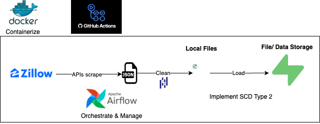
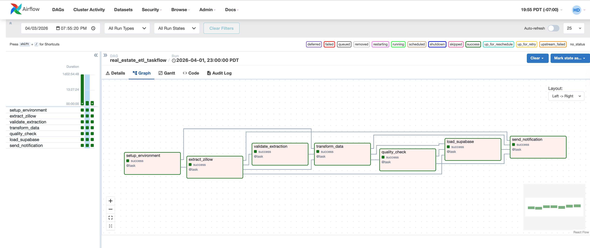

[](https://github.com/HaDo1802/zillow_data_extract/actions/workflows/ci.yml)


# Real Estate Data Pipeline

<div align="center">
  
</div>

This project is a production-oriented EL pipeline for Zillow real estate listings data. It extracts property data from the Zillow API, applies light cleaning, and stages both raw and transformed outputs in Supabase Storage for downstream transformation and modeling layers.

The pipeline is orchestrated with Apache Airflow and is designed around two operational goals:

- reproducible runs for the same logical date
- clear separation between ingestion/staging and downstream transformation

---

## Overview

**Tech Stack**


**Pipeline flow**

```text
Zillow API -> Raw CSV -> Transform -> Supabase Storage -> Downstream Analytics / Modeling
```

**Deployment flow**

```text
git push main -> GitHub Actions (CI: lint, test, build, push image) -> CD: SSH deploy to EC2 -> Airflow on EC2 runs DAG on schedule
```

<div align="center">



</div>

**Current scope**

- Source: Zillow API via [RapidAPI](https://rapidapi.com/apimaker/api/zillow-com1/playground)
- Market focus: Las Vegas, NV
- Orchestration: Apache Airflow
- Storage layer: Supabase Storage
- Output artifacts: raw CSV, transformed CSV, and `_latest.json` manifest

---

## Repository Structure

```text
.
├── dags/
│   └── TaskAPI_etl_dag.py
├── etl/
│   ├── extract.py
│   ├── transform.py
│   ├── load.py
│   ├── main_etl.py
│   └── email_notifier.py
├── data/
│   ├── raw/
│   └── transformed/
├── tests/
│   ├── test_extract.py
│   ├── test_load.py
│   └── test_transform.py
├── .github/workflows/
│   ├── ci.yml
│   └── cd.yml
├── terraform/
├── pyproject.toml
├── uv.lock
├── requirements-airflow.txt
└── README.md
```

**Core modules**

- `etl/extract.py`: fetches Zillow listings with controlled pagination and rate limiting
- `etl/transform.py`: cleans, standardizes, and enriches the raw dataset
- `etl/load.py`: uploads raw and transformed outputs to Supabase Storage and publishes a manifest
- `etl/main_etl.py`: local entrypoint for running the ETL outside Airflow
- `dags/TaskAPI_etl_dag.py`: Airflow TaskFlow DAG for scheduled execution

---

## Airflow Orchestration

This pipeline is orchestrated in Airflow and runs inside Docker. The Airflow UI helps inspect DAG state, task logs, retries, and end-to-end pipeline runs.

<div align="center">
  
</div>

---

## Data Pipeline Details

### Extract

- Pulls listing data from the Zillow API via RapidAPI
- Supports configurable locations and page limits
- Uses deterministic page sampling when `snapshot_date` is provided
- Writes `raw_latest.csv` and a date-stamped raw snapshot under `data/raw/`

### Transform

- Standardizes address and listing fields
- Cleans missing or inconsistent values
- Enriches the dataset with derived features used downstream
- Writes `transformed_latest.csv` and a date-stamped transformed snapshot under `data/transformed/`

### Load

- Uploads raw and transformed CSVs to Supabase Storage
- Publishes `raw/_latest.json` so downstream jobs can resolve the latest logical snapshot
- Stores stable object keys derived from `snapshot_date` and `etl_run_id`

---
# Side Note
## Idempotency And Reproducibility

The pipeline is designed to be retry-safe and reproducible at the artifact level for the same logical date.

**What is deterministic / Idempotent**

- Airflow passes `data_interval_start` downstream as `snapshot_date` and `etl_run_id`
- extraction seeds page sampling from `snapshot_date`, so retries fetch the same page set
- load object keys are derived from the logical date rather than wall-clock retry time
- Supabase uploads use upsert behavior, so retries overwrite the same storage objects
- `_latest.json` gives downstream consumers a stable pointer to the current logical snapshot

Note: The pipeline is designed to be idempotent for run identity and artifact paths, while exact row-level content still depends on the upstream source system.

---

## Architecture Design Rationale

### Why Airflow

- task orchestration with explicit dependencies
- retry support and scheduling
- operational visibility through the Airflow UI
- cleaner production scheduling than ad hoc cron jobs

### Why Supabase Storage

- Free and easy to set up
- keeps ingestion separate from downstream warehouse/modeling logic
- provides durable storage for raw and transformed artifacts
- supports replay and backfill workflows
- lets downstream jobs consume a manifest instead of guessing file paths

### Why _latest.json

- Supabase Storage is object storage, not a warehouse table with native load metadata or a built-in `COPY INTO` history layer
- Downstream jobs need a stable way to discover the most recent successful raw snapshot without scanning folders or inferring file names.
- This keeps the handoff contract explicit and makes downstream consumption simpler, more reliable, and easier to automate.

### Why EC2 over GitHub Actions for scheduling

GitHub Actions VMs are ephemeral — they spin up, run a job, and shut down. They cannot host a persistent Airflow scheduler. An always-on EC2 t2.micro runs continuously so Airflow can trigger the DAG on schedule without a laptop being open.

An EC2-based production deployment is implemented in the [`feat/aws-ec2-terraform`](https://github.com/HaDo1802/zillow_data_extract/tree/feat/aws-ec2-terraform) branch, using Terraform to provision the instance and a split CI/CD pipeline (ci.yml + cd.yml) for image-based deployment. See [`terraform/README.md`](terraform/README.md) for full infrastructure design details.

The current `main` branch keeps the GitHub Actions scheduled pipeline as the active setup — it is free and sufficient for the scope of this project.

### Why UTC

All pipeline timestamps use UTC to avoid timezone drift, daylight saving issues, and ambiguous historical comparisons across systems.

---

## Getting Started

### Prerequisites

Install [uv](https://docs.astral.sh/uv/) — the package manager used by this project:

```bash
curl -LsSf https://astral.sh/uv/install.sh | sh
```

### Local development setup

```bash
# Install all dependencies (creates .venv automatically)
uv sync --group dev

# Run the ETL pipeline locally
uv run python etl/main_etl.py

# Run tests
uv run pytest tests/ -v

# Format and lint
uv run black etl/ tests/ dags/ --line-length 127
uv run isort etl/ tests/ dags/ --profile black
uv run flake8 etl/ tests/ dags/ --max-line-length=127
```

Or use the Makefile shortcuts:

```bash
make install-dev   # uv sync --group dev
make test          # uv run pytest
make format        # black + isort
make lint          # flake8
make run-etl       # uv run python etl/main_etl.py
```

### Dependency management

| File | Purpose |
|---|---|
| `pyproject.toml` | Source of truth — declares all dependencies and tool config |
| `uv.lock` | Exact pinned versions — commit this for reproducible installs |
| `requirements-airflow.txt` | Docker-only — installed into the Airflow base image with Airflow's constraint URL |


## Operational Notes

- The pipeline auto-detects local vs Airflow-style execution paths
- Logging is centralized through the project logger
- Email notifications are sent on pipeline success or failure

---

## Downstream Handoff

This project stops at staged delivery. It does not load directly into a warehouse table. Instead, it publishes raw and transformed snapshots to Supabase Storage so downstream systems can consume a stable, versioned handoff layer.

Downstream project:

```text
https://github.com/HaDo1802/zillow_data_transformation
```
